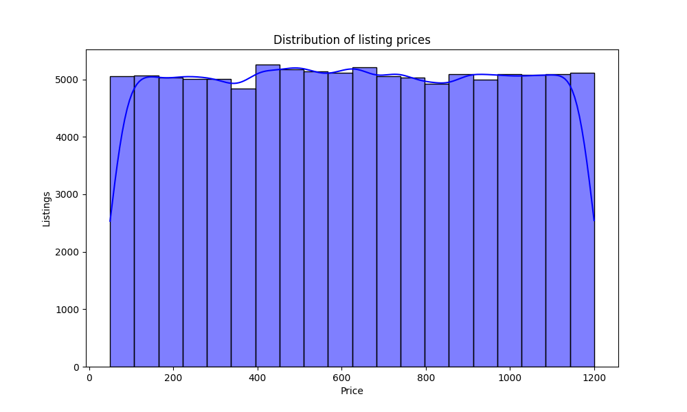
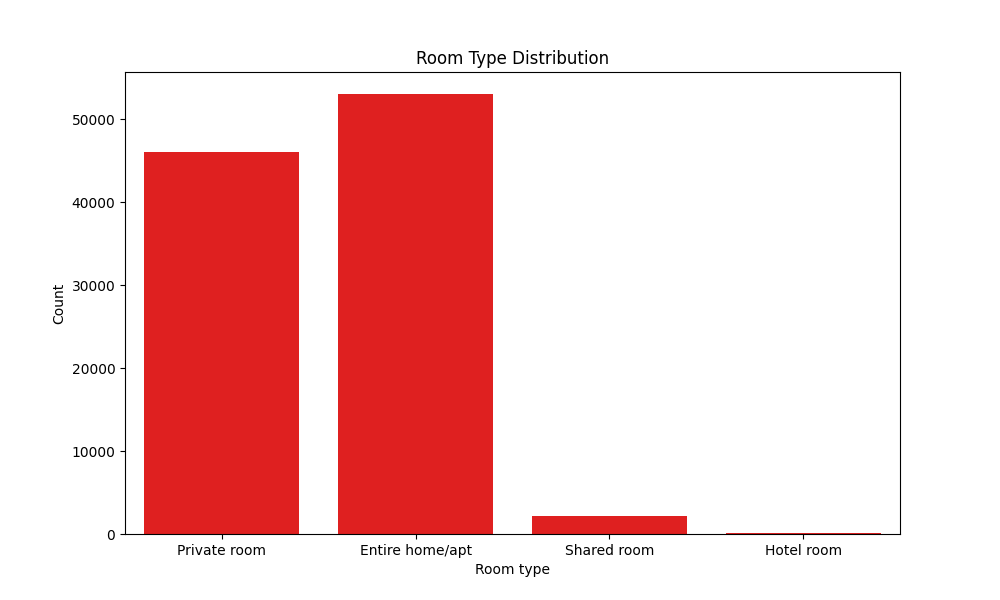
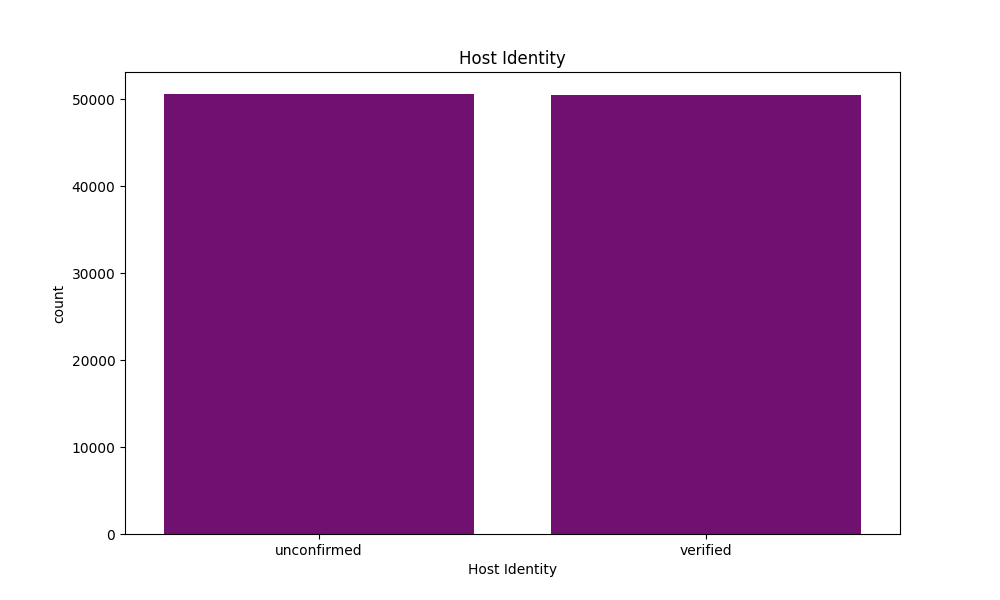

# Airbnb Exploratory Data Analysis (EDA)

## Project Overview

This project focuses on Exploratory Data Analysis (EDA) of an Airbnb dataset using Python libraries such as Pandas, Matplotlib, and Seaborn.

The objective of this project is to clean the dataset, analyze important business questions, and extract meaningful insights through visualizations.

---

# Tools & Libraries Used

* Python
* Pandas
* NumPy
* Matplotlib
* Seaborn
* Jupyter Notebook

---

# Dataset Features

The dataset contains information related to:

* Listing prices
* Room types
* Neighbourhood groups
* Host verification
* Service fees
* Minimum nights
* Reviews and ratings

---

# Data Cleaning Performed

* Removed duplicate records
* Handled missing values
* Converted object columns into numeric format
* Removed invalid values
* Cleaned inconsistent category names

---

# Business Questions Explored

* What is the distribution of listing prices?
* How are room types distributed?
* Which neighbourhood groups have the highest listings?
* What is the relationship between room type and price?
* How does service fee vary according to room type?
* Verified vs unconfirmed hosts analysis

---

# Key Insights

* Entire home/apartment listings are the most common on the platform.
* Manhattan and Brooklyn contain the highest number of Airbnb listings.
* Hotel rooms tend to have slightly higher pricing ranges.
* Service fee distribution is relatively similar across room types.
* Verified and unconfirmed hosts are present in nearly equal numbers.
* Increasing host verification may improve customer trust and platform credibility.

---

# Visualizations

## Price Distribution

---

## Room Type Distribution

---

## Listings by Neighbourhood Group

---

## Host Identity Verification

---

# Project Structure

Airbnb-EDA-SemiGuided/

├── data/

├── images/

├── notebook/

└── README.md

---

# Conclusion

This project helped in understanding the complete EDA workflow including:

* Data cleaning
* Visualization
* Business insight generation
* Analyst-style thinking

It also strengthened practical skills in Pandas and data analysis workflow.
